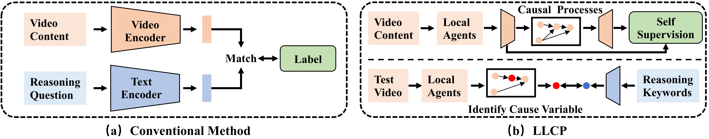

# LLCP: Learning Latent Causal Processes for Reasoning-based Video Question Answer

This repository contains the implementation for ICLR2024 paper __LLCP: Learning Latent Causal Processes for Reasoning-based Video Question Answer__ [pdf](https://openreview.net/pdf?id=Cu5wJa5LGO)

LLCP is a causal framework designed to enhance video reasoning by focusing on the spatial-temporal dynamics of objects within events, without the need for extensive data annotations. By employing self-supervised learning and leveraging the modularity of causal mechanisms, LLCP learns multivariate generative model for spatial-temporal dynamics and thus enables effective accident attribution and counterfactual prediction of Reasoning-based VideoQA.



## Environment
First, please install the recent version of Pytorch and Torchvision as `pip install torch torchvision`. Then, you can install other package by running `pip install -r requirements.txt`

## Download Data
Due the time consuming data pre-process (tracking the variable and obtain the CLIP feature), we provide the processed features used in our experiments with an an Anonymous link. Please download the data and model in this [link1](https://drive.google.com/drive/folders/17TDv6CxenKlyr8W2gnmrojnGP82kwlqp?usp=share_link) and this [link2](https://drive.google.com/drive/folders/1BGBiY1_qp0ElHORLi4y0AEyh79Hnn9oN?usp=share_link). Then please decompress the floders as `./data/` and `./results/` and replace the original floders as the downloaded ones.

The directory structure should look like
```
LLCP_VQA/
|–– config.py
|–– configs/
|–– data/
|   |–– object_test_feat/
|   |–– object_train_feat/
|   |–– appearance_feat_rn50.h5
|   |–– test_questions.pt
|   |–– train_questions.pt
|–– DataLoader.py
|–– models_cvae.py
|–– requirements.txt
|–– results/
|   |–– .../model_cvae49.pt
|–– README.md
|–– train.py
|–– validate.py
```

## Run Scripts

To train the cvae model, you can run this command:
```
python train.py --cfg configs/sutd-traffic_transition.yml
```

To evalaute the trained model, please refer to:
```
python validate.py --cfg configs/sutd-traffic_transition.yml
```


## Simulation Experiments of LLCP

See [LLCP-Simulation](LLCP_simulation/).

## License
MIT License

## Citation
If you find our work useful in your research, please consider citing:
```
@inproceedings{chen2024llcp,
  title={LLCP: Learning Latent Causal Processes for Reasoning-based Video Question Answer},
  author={Chen, Guangyi and Li, Yuke and Liu, Xiao and Li, Zijian and Al Surad, Eman and Wei, Donglai and Zhang, Kun}
  booktitle={ICLR},
  year={2024}
}
```


